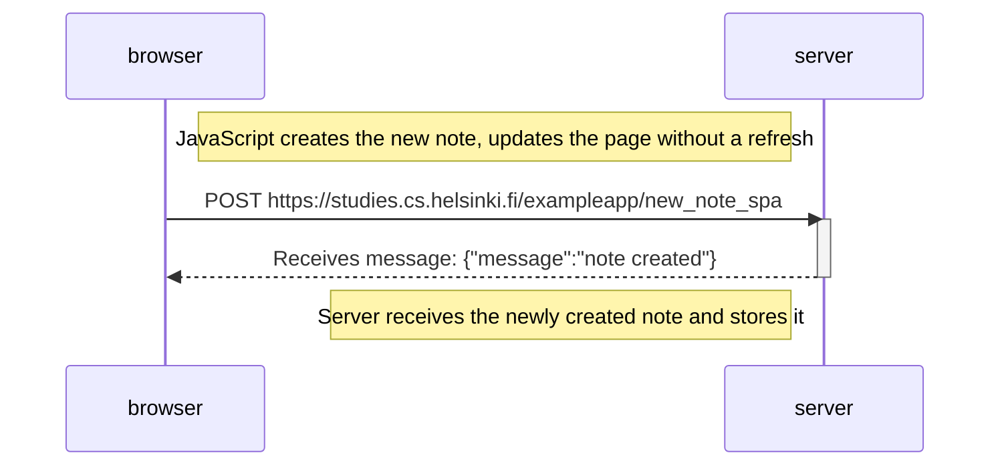

```mermaid
sequenceDiagram
    participant browser
    participant server

    Note right of browser: JavaScript creates the new note, updates the page without a refresh

    browser->>server: POST https://studies.cs.helsinki.fi/exampleapp/new_note_spa
    activate server
    server-->>browser: Receives message: {"message":"note created"}
    deactivate server

    Note left of server: Server receives the newly created note and stores it
```
